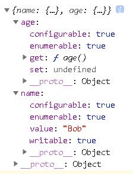
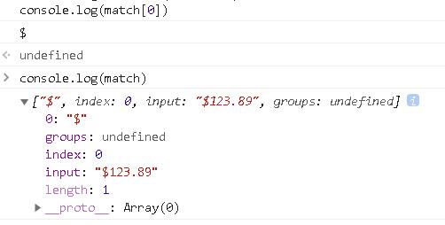
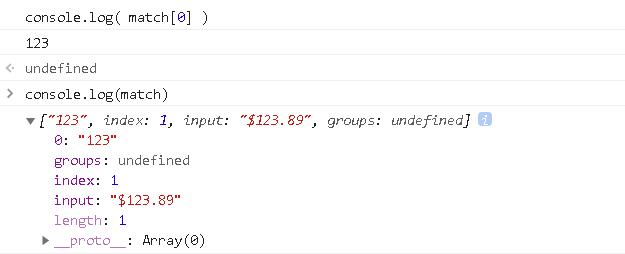
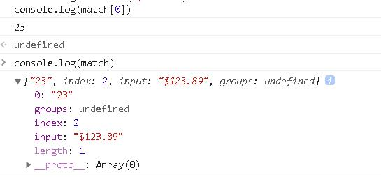

# ES6 新特性
* 类
* 模块化
* 函数参数默认值
* 模板字符串
* 解构赋值
* 延展操作符
* 对象属性缩写
* Promise
* let 和 const

## 1. 类
* ES6 引入了 class（类），让 JavaScript 的面向对象变得更加简单和易于理解
1. 不使用 class（类）
```javascript

    function Phone(brand, price) {
        this.brand = brand
        this.price = price
    }
    // 在原型上添加方法
    Phone.prototype.call = function () {
        console.log('我可以打电话')
    }
    // 实例化对象
    let Huawei = new Phone('华为', 5000)
    Huawei.call()
    console.log(Huawei)
```


2. 不使用 class（类）继承
```javascript
        // 手机
        function Phone(brand, price){
            this.brand = brand;
            this.price = price;
        }

        Phone.prototype.call = function(){
            console.log("我可以打电话");
        }

        // 智能手机
        function SmartPhone(brand, price, color, size){
            Phone.call(this, brand, price);
            this.color = color;
            this.size = size;
        }

        // 设置子级构造函数的原型
        SmartPhone.prototype = new Phone;
        SmartPhone.prototype.constructor = SmartPhone;

        // 声明子类的方法
        SmartPhone.prototype.photo = function(){
            console.log("我可以拍照")
        }

        SmartPhone.prototype.playGame = function(){
            console.log("我可以玩游戏");
        }

        const chuizi = new SmartPhone('锤子',2499,'黑色','5.5inch');

        console.log(chuizi);
        chuizi.call()
        chuizi.photo()
        chuizi.playGame()

```


3. 使用class（类）
    * 构造函数在实例化的时候将会被调用，如果不指定，那么就会有一个不带参数的默认构造函数
```javascript
    Class Shouji {
        // 构造方法 名字不能修改
        constuctor (brand, price) {
            this.brand = brand
            this.price = price
        }
        call () {
            console.log('我可以打电话')
        }
    }
    let onePlus = new Shouji("1+", 1999);
    console.log(onePlus);
    console.log(onePlus.call());
```


4. 使用类继承
    * 子类必须要在 constructor 中指定 super 函数，否则在新建实例的时候会报错
    * 如果没有置顶 constructor，默认带 super 函数的 constructor 将会被添加
```javascript
    class vivo extends Shouji{
        constructor(brand, price, dosome) {
            super(brand, price)
            this.dosome = dosome
        }
        toString () {
            console.log('hello');
        }
    }

    let vivox = new vivo('x21',2000,'拍照')
    console.log(vivox);
    console.log(vivox.toString());
```


5. class 的 get 和 set 
```javascript
    class Phone {
        get price () {
            console.log('价格属性被读取了')
            return '价格是....'
        }
        set price(newValue) {
            console.log('价格属性被修改了')
        }
    }
    let oppo = new Phone()
    console.log(oppo.price)
    oppo.price = 'free'
```


6. class 的静态成员
```javascript
    class Phone{
        // 静态属性
        static name = '手机';
        static change(){
            console.log("我可以改变世界");
        }
    }

    let nokia = new Phone();
    console.log(nokia.name);
    console.log(Phone.name);
    console.log(Phone.change())
    console.log(nokia.change())
```


## 2. 模块化
* ES5 不支持原生的模块化，在 ES6 中模块作为重要的组成部分被添加进来。模块的功能主要由 export 和 import 组成。每一个模块都有自己单独的作用域，模块之间的相互调用关系是通过 export 来规定模块对外暴露的接口，通过 import 来引用其他模块提供的接口。同时还为模块创造了命名空间，防止函数的命名冲突
1. 导出（export）
    * ES6 允许在一个模块中使用 export 来导出多个变量或函数
2. 导出变量
```javascript
    // test.js
    export var name = 'test'
```
ES6 将一个文件视为一个模块，上面的模块通过 export 向外输出了一个变量。一个模块也可以同时向外输出多个变量
```javascript
    var name = 'test'
    var age = 18
    export {name, age}
```
3. 导出函数
```javascript
    // myModule.js
    export function myModule (someArg) {
        return someArg
    }
```
4. 导入（import）
定义好模板的输出以后就可以在另外一个模块通过 import 引用
```javascript
    import {myModule} form 'myModule' // main.js
    import {name, age} form 'test' // test.js
```

## 3. 箭头(Arrow)函数
* => 不只是关键字 function 的缩写，它还带来了其他好处。箭头函数与包围它的代码共享同一个 this，能很好的解决 this 的指向问题。比如 var self = this 或 var that = this 这种引入外围 this 的模式，但是使用 => ，就不需要这么麻烦了
### 箭头函数的结构
* 箭头函数的箭头 => 之前是一个括号、单个的参数名、或用括号括起来的多个参数名，而箭头之后可以是一个表达式（作为函数的返回值），或者是用花括号括起的函数体（需要自行通过 return 来返回值，否则返回的是 undefined）
```javascript
    () => 1
    v => v + 1
    (a, b) => a + b
    () => {
        alert('test')
    }
    e => {
        if (e == 0) {
            return 0
        }
        return 100
    }
```

* 注意：不论是箭头函数还是 bind，每次被执行都返回的是一个新的函数引用，因此如果需要函数的引用去做一些别的事情（比如卸载监听器），那么就需要保存这个引用

### 特性
1. this 是静态的，this 始终指向函数声明时所在作用域下的 this 的值，箭头函数的 this 只取决于定义时的环境
2. 不能作为构造实例化对象
3. 不能使用 arguments 变量
4. 箭头函数的缩写
    1. 省略小括号，当形参有且只有一个的时候
    2. 省略花括号，当代码体只有一条语句的时候，此时 return 必须省略，而且语句的执行结果就是函数的返回值
5. 因为箭头函数没有 this，所以一切改变箭头函数 this 指向都是无效的
*  比如 fn 箭头函数在 window 环境下定义的，无论如何调用，this 都指向 window  

## 4. 函数参数默认值
* ES6 允许给函数参数赋值初始值
    1. 形参初始值，具有默认值的参数，一般位置都要靠后（潜规则）
        ```javascript
            function foo (height = 50, width = 100, color = 'red') {
                ...
            }
        ```
        * 不使用默认值
        ```javascript
            function foo (hight, color) {
                var height = height || 50
                var color = color || 'red'
                return height + '+' + color
            }
        ```
        * 当参数的布尔值为 false 时，就会出现问题
        * 比如：foo(0, "")  // 50 + red
            * 因为 0 的布尔值为 false，这样 height 的取值将是 50，同理 color 的取值为 'red' 

    2. 与解构赋值结合
        ```javascript
            function connect({host="127.0.0.1", username,password, port}){
            console.log(host)
            console.log(username)
            console.log(password)
            console.log(port)
            }
            connect({
                // host: 'Evildoer98.com',
                username: 'root',
                password: '123456',
                port: 3306
            })
        ```
        
    
## 5. 模板字符串
* ES6 引入新的声明字符串的方式
1. 声明
```javascript
    let str = `我是一个字符串`
    console.log(str, typeof str) // 我是一个字符串 string
```
2. 内容中可以直接出现换行符
```javascript
    let str = `<ul>
                <li>沈腾</li>
                <li>玛丽</li>
                <li>魏翔</li>
                <li>艾伦</li>
                </ul>`;
```
3. 变量拼接
```javascript 
    let star = '小星星'
    let out = `${star} 是个人`
    console.log(out) // 小星星是个人
```
* 在 ES6 中通过 ${} 就可以完成字串符的拼接，只需要将变量放在大括号中即可

## 6. 解构赋值
* ES6 允许按照一定模式从数组和对象中提取值，对变量进行赋值
1. 数组的解构：
    * 从数组中获取值并赋值到变量中，变量的顺序与数组中对象顺序对应
    ```javascript
        const F4 = ['小沈阳','刘能','赵四','宋小宝']
        let [xiao, liu, zhao, song] = F4
        console.log(xiao) // 小沈阳
        console.log(liu) // 刘能
        console.log(zhao) // 赵四
        console.log(song) // 宋小宝

        var foo = ['one', 'two', 'three', 'four']
        var [one, two, three] = foo
        console.log(one) // one
        console.log(two) // two
        console.log(three) // three

        // 如果要忽略某些值，可以按照下面的写法获取需要的值
        var [first, , ,last] = foo
        console.log(first) // one
        console.log(last) // four

        var a, b
        [a, b] = [1, 2]
        console.log(a) // 1
        console.log(b) // 2
    ```
    * 如果没有从数组中获取到值，你可以为变量设置一个默认值
    ```javascript
        var a, b
        [a = 5, b = 7] = [1]
        console.log(a) // 5
        console.log(b) // 7
    ```
    * 通过解构赋值可以方便交换两个变量的值
    ```javascript
        var a = 1
        var b = 5
        [a, b] = [b, a]
        console.log(a) // 1
        console.log(b) // 5
    ```

2. 对象的解构
```javascript
    const zhao = {
        name: '赵本山',
        age: '不详',
        xiaopin: function () {
            console.log('我可以演小品')
        }
    }
    let {name, age, xiaopin} = zhao
    console.log(name) // 赵本山
    console.log(age) // 不详
    console.log(xiaopin) // f () { console.log('我可以演小品') }
    console.log(xiaopin()) // 我可以演小品
```

## 7. 拓展运算符
* 拓展运算符 ... 可以在函数调用/数组构造时，将数组表达式或者 string 在语法层面展开，还可以构造对象时，将对象表达式按 key-value 的方式展开
* 语法：
    * 函数调用：myfunction(...iterableObj)
    * 数组构造或字符串：[...iterableObj, '4', ...'hello', 6]
    * 构造对象时，进行克隆或者属性拷贝：let objClone = {...obj}
* 应用场景
    * 在函数调用时使用拓展运算符
    ```javascript
        function sum (x, y, z) {
            return x + y + z
        }
        const numbers = [1, 2, 3]
        // 不使用拓展运算符
        console.log(sum.apply(null, numbers)) // 6
        // 使用拓展运算符
        console.log(sum(...numbers)) // 6
    ```

    * 构造数组
        * 没有展开语法的时候，只能组合使用 push、splice、concat 等方法，来将已有数组元素变成新数组的一部分。有了展开语法，构造新数组会变得更简单、更优雅
        * 和参数列表的展开类似，...在构造数组时，可以在任意位置多次使用
    ```javascript
        const students = ['john', 'tom']
        const persons = ['alice', ...students, 'bob', 'baby']
        console.log(presons) // 'alice', 'john', 'tom', 'bob', 'baby'
    ```

    * 数组拷贝
        * 展开语法和 Object.assign() 行为一致，执行的都是浅拷贝（只遍历一层）
    ```javascript 
        var arr = [1, 2, 3]
        var arr2 = [...arr] // 等同于 arr.slice()
        arr2.push(4)
        console.log(arr2) // [1, 2, 3, 4]
    ```

    * 连接多个数组
    ```javascript
        var arr1 = [0, 1, 2]
        var arr2 = [3, 4, 5]
        var arr3 = [...arr1, ...arr2] // 将 arr 中所有元素附加到 arr1 后面并返回
        // 等同于
        var arr4 = arr1.concat(arr2)
    ```

    * 对象
    ```javascript
        var obj1 = {foo: 'hello', x: 18}
        var obj2 = {foo: 'world', x: 20}

        var cloneObj = {...obj1} // 克隆后对象：{foo: 'hello', x: 18}
        var mergeObj = {...obj1, ...obj2} // 合并后的对象：{foo: 'world', x: 18, y: 20}
    ```

## 8. 对象属性简写
* 在 ES6 中允许我们在设置一个对象的属性的时候不指定属性名
* 不使用 ES6
    ```javascript
        const name = 'ming',
              age = 18,
              city = '成都'

        const student = {
            name: name, 
            age: age,
            city: city
        }
        console.log(student) // {name: 'ming', age: 18, city: '成都'}
    ```
* 使用 ES6
    ```javascript
        const name = 'ming',
              age = 18,
              city = '成都'

        const student = {
            name,
            age,
            city
        }
        console.log(student) // {name: 'name', age: 18, city: '成都'}

    ```

## 9. Promise
* Promise 是异步编程的一种解决方案，比传统的解决方案 callback 更加的优雅。它最早由社区提出和实现的，ES6 将其写进了语言标准，统一了用法，原生提供了 Promise 对象
* 不使用 ES6
    * 嵌套两个 settimeout 回调函数
    ```javascript
        setTimeout(function (){
            console.log('Hello') // 1 秒后输出 'hello'
            setTimeout(function () {
                console.log('world') // 2 秒后输出 'world'
            }, 1000)
        }, 1000)
    ```
* 使用 ES6
    * 两个 then 来进行一步编程串行化，避免了回调地狱
    ```javascript
        var waitSecond = new Promise (function (resolve, reject) {
            setTimeout(resolve, 1000)
        })
        waitSecond.then(function () {
            console.log('hello') // 1 秒后输出 'hello'
            return waitSecond
        })
        .then(function () {
            console.log('world') // 2 秒后输出 'world'
        })

    ```

## 10. 支持 let 与 const
* 在之前 JS 是没有块级作用域，const 与 let 都是块级作用域
* 使用 var 定义的变量为函数级作用域
    ```javascript
        {
            var a = 10
        }
        console.log(a) // 10
    ```
* 使用 let 与 const 定义的变量为块级作用域
    ```javascript
        {
            let a = 10
        }
        console.log(a) // Uncaught ReferenceError: a is not defined
    ```

# ES7
* 数组 includes() 方法，用来判断一个数组是否包含一个指定的值，根据情况，如果包含则返回 true，否则返回 false
* a ** b 指数运算符，它与 Math.pow(a, b)
## 1. Array.prototype.includes()
* includes() 函数用来判断一个数组是否包含一个指定的值，如果包含则返回 true，否则返回 false
* includes() 函数与 indexOf 函数很相似，下面两个表达式是等价的：
    ```javascript
        arr.include(x)
        arr.indexOf(x) >= 0
    ```
* 在 ES7 之前的做法
    * indexOf() 验证数组中是否存在某个元素，这时需要根据返回值是否为 -1 来判断
    ```javascript
        let arr = ['react', 'angular', 'vue']
        if (arr.indexOf('react') !== -1) {
            console.log(' react 存在 ')
            return true
        } else {
            console.log(' react 不存在 ')
            return false
        }
    ```
* 在 ES7 的includes()
    * 使用 includes() 验证数组中是否存在某个元素
    ```javascript
        let arr = ['react', 'angular', 'vue']
        if (arr.includes('react')) {
            console.log(' react 存在 ')
            return true
        } else {
            console.log(' react 不存在 ')
            return false
        }
    ```

## 2. 指数操作符
* 在 ES7 中引入了指数运算符 ** ， ** 具有与 Math.pow(...) 等效的计算结果
* 不使用指数操作符
    * 使用自定义的递归函数 calculateExponent 或者 Math.pow() 进行指数运算
    ```javascript
        function calculateExponent (base, exponent) {
            if (exponent === 1) {
                return base
            } else {
                return base * calculateExponent(base, exponent - 1)
            }
        }
        console.log(calculateExponent(2, 10)) // 1024
        console.log(Math.pow(2, 10)) // 1024
    ```
* 使用指数操作符
    * 使用指数运算符 ** ，就像 + 、- 等操作符一样
    ```javascript
        console.log(2**10) // 1024
    ```

# ES8
* async/await
* Object.values()
* Object.entries()
* String padding: padStart() 和 padEnd()，填充字符串达到当前长度
* 函数参数列表结尾允许逗号
* Object.getOwnPropertyDescriptors()
* ShareArrayBuffer 和 Atomics 对象，用于从共享内存位置读取和写入
## 1. async/await
* ES2018 引入异步迭代器（asyncchronous iterators），就像常规迭代器，除了 next() 方法返回一个 Promise。因此 await 可以和 for...of 循环一起使用，以串行的方式运行异步操作。
* eg：
    ```javascript
        async function process (array) {
            for await (let i of array) {
                doSomething(i)
            }
        }
    ```

## 2. Object.values()
* Object.values() 是一个与 Object.keys() 类似的新函数，但返回的是 Object 自身属性的所有值，不包括继承的值
* eg：
    ```javascript
        // 遍历对象 obj 的所有值
        const obj = {a: 1, b: 2, c: 3}

        // 不使用 Object.values()
        const  vals = Object.keys(obj).map(key => obj[key])
        console.log(vals) // [1, 2, 3]

        // 使用 Object.values()
        const values = Object.values(obj)
        console.log(values) // [1, 2, 3]
    ```
* Object.values() 为我们省去了遍历 key，并根据这些 key 获取 value 的步骤

## 3. Object.entries()
* Object.entries() 函数返回一个给定对象自身可枚举属性的键值对的数组
* eg：
    ```javascript
        // 不使用 Object.entries
        Object.keys(obj).forEach(key => {
            console.log('key:' + key + 'value:' + obj[key])
        })
        // key: a  value: 1
        // key: b  value: 2
        // key: c  value: 3

        // 使用 Object.entries
        for(let [key, value] of Object.entries(obj)) {
            console.log(`key: ${key}  value: ${value}`)
        }
        // key: a  value: 1
        // key: b  value: 2
        // key: c  value: 3
    ```

## 4. String padding
* 在 ES8 中 String 新增了两个实例函数 String.prototype.padStart 和 String.prototype.padEnd，允许将空字符串或其他字符串添加到原始字符串的开头或结尾
    ```javascript
        String.padStart(targetLength, padString)
        String.padEnd(targetLength, padString) 
    ```
    * targetLength：当前字符串需要填充到的目标长度。如果这个数值小于当前字符串的长度，则返回当前字符串本身
    * padString（可选）：填充字符串。如果字符串太长，使填充后的长度超过了目标长度，则只保留最左侧的部分，其他部分会被截断，此参数的缺省值为 " "。
        ```javascript
            console.log('0.0'.padStart(4, '10')) // 10.0
            console.log('0.0'.padStart(20)) //                 0.00

            console.log('0.0'.padEnd(4, '0')) // 0.00
            console.log('0.0'.padEnd(10, '0')) // 0.00000000
        ```

## 5. 函数参数列表结尾允许逗号
* 主要作用是方便使用 git 进行多人协作开发时修改同一个函数减少不必要的行变更

## 6. Object.getOwnPropertyDescriptors()
* Object.getOwnPropertyDescriptors() 函数用来获取一个对象的所有自身属性的描述符，如果没有任何自身属性，则返回空对象
    ```javascript
        Object.getOwnPropertyDescriptors(obj)
    ```
    * 返回 obj 对象的所有自身属性的描述符，如果没有任何自身属性，则返回空对象
        ```javascript
            const obj = {
                name: 'Bob',
                get age() {
                    return '18'
                }
            }
            Object.getOwnPropertyDescriptors(obj)
        ```
        

## 7. SharedArrayBuffer 对象
* SharedArrayBuffer 对象用来表示一个通用的、固定长度的原始二进制数据缓冲区，类似于 ArrayBuffer 对象，他们都可以用来在共享内存（shared memory）上创建视图。与 ArrayBuffer 不同的是，SharedArrayBuffer 不能被分离
```javascript
    /**
     * @param {*} length 所创建的数组缓冲区的大小，以字节（byte）为单位
     * @returns {SharedArrayBuffer} 一个大小指定的新的 SharedArrayBuffer 对象，其内容被初始化为 0
     */
    new SharedArrayBuffer(length)
```

## 8. Atomics 对象
* Atomics 对象提供了一组静态方法用来对 SharedArrayBuffer 对象进行原子操作
* 这些原子操作属于 Atomics 模块，与一般的全局对象不同，Atomics 不是构造函数，因此不能使用 new 操作符调用，也不能将其当做函数直接调用。Atomics 的所有属性和方法都是静态的（与 Math 对象一样）
* 多个共享内容的线程能够同时读写同一位置上的数据。原子操作会确保正在读或写的数据的值是符合预期的，即下一个原子操作一定会在上一个原子操作结束后才会开始，其操作过程不会中断
    * Atomics.add() 将指定位置上的数组元素与给定的值相加，并返回相加前该元素的值
    * Atomics.and() 将指定位置上的数组元素与给定的值相与，并返回与操作前该元素的值
    * Atomics.compareExchange() 如果数组中指定元素与给定的值相等，则将其更新为新的值，并返回该元素原来的值
    * Atomics.exchange() 将数组中指定的元素更新为给定的值，并返回该元素更新前的值。
    * Atomics.load() 返回数组中指定元素的值。
    * Atomics.or() 将指定位置上的数组元素与给定的值相或，并返回或操作前该元素的值。
    * Atomics.store() 将数组中指定的元素设置为给定的值，并返回该值。
    * Atomics.sub() 将指定位置上的数组元素与给定的值相减，并返回相减前该元素的值。
    * Atomics.xor() 将指定位置上的数组元素与给定的值相异或，并返回异或操作前该元素的值。
* wait() 和 wake() 方法采用的是 Linux 上的 futexes 模型（fast user-space mutex，快速用户空间互斥量），可以让进程一直等待直到某个特定的条件为真，主要用于实现阻塞。
    * Atomics.wait() 检测数组中某个指定位置上的值是否仍然是给定值，是则保持挂起直到被唤醒或超时。返回值为 "ok"、"not-equal" 或 "time-out"。调用时，如果当前线程不允许阻塞，则会抛出异常（大多数浏览器都不允许在主线程中调用 wait()）。
    * Atomics.wake() 唤醒等待队列中正在数组指定位置的元素上等待的线程。返回值为成功唤醒的线程数量。
    * Atomics.isLockFree(size) 可以用来检测当前系统是否支持硬件级的原子操作。对于指定大小的数组，如果当前系统支持硬件级的原子操作，则返回 true；否则就意味着对于该数组，Atomics 对* 象中的各原子操作都只能用锁来实现

# ES9
* 异步迭代
* Promise.finally()
* Rest/Spread 属性
* 正则表达式命名捕获组（Regular Expression Named Capture Groups）
* 正则表达式反向断言（lookbehind）
* 正则表达式dotAll模式
* 正则表达式 Unicode 转义
* 非转义序列的模板字符串

## 1. 异步迭代
* 在 async/await 的某些时刻，可以在同步循环中调用异步函数
* ES2018 引入异步迭代器（asynchronous iterators），这就像常规迭代器，除了 next() 方法返回一个 Promise。因此 await 可以和 for...of 循环一起使用，以串行的方式运行异步操作
* eg：
    ```javascript
        async function process(array) {
            for await (let i of array) {
                doSomething(i);
            }
        }
    ```

## 2. Promise.finally()
* 一个 Promise 调用链要么成功到达最后一个 .then()，要么失败触发 .catch()。在某些情况下，想要无论 Promise 运行成功还是失败，都运行相同的代码。
    ```javascript
        let connection
        db.open()
        .then(conn => {
            connection = conn;
            return connection.select({ name: 'Jane' });
        })
        .then(result => {
            // Process result
            // Use `connection` to make more queries
        })
        ···
        .catch(error => {
            // handle errors
        })
        .finally(() => {
            connection.close();
        });
    ```
* 应用场景：清除、删除对话，关闭数据库连接等等

## 3. Rest/Spread 属性
* ES2015 引入了 Rest 参数 和 拓展运算符。三个点（...）仅用于数组。Rest 参数语法允许将一个不定数量的参数表示为一个数组
    ```javascript
        restParam(1, 2, 3, 4, 5)
        function restParam(p1, p2, ...p3) {
            // p1 = 1
            // p2 = 2
            // p3 = [3, 4, 5]
        }
    ```
    * 展开操作符以相反的方式工作，将数组转换成可传递给函数的单独参数
    * eg：Math.max() 返回给定数字中的最大值
        ```javascript
            const values = [99, 100, -1, 48, 16]
            console.log(Math.max(...values)) // 100
        ```
* ES2018 为对象解构提供了和数组一样的 Rest 参数() 和 展开操作符
    * eg：
        ```javascript
            const myObject = {
                a: 1,
                b: 2,
                c: 3
            }
            const {a, ...x} = myObject
            // a = 1
            // x = {b: 2, c: 3}

            // 或者
            function restParam({a, ...x}) {
                // a = 1
                // x = {b: 2, c: 3}
            }
        ```
    * 跟数组一样，Rest 参数只能在声明的结尾处使用。此外，它只使用与每个对象的顶层，如果对象中嵌套对象则无法适用
* 拓展运算符可以在其他对象内使用
    * eg：
        ```javascript
            const obj1 = {a: 1, b: 2, c: 3}
            const obj2 = {...obj1, z: 4}
            // obj2 is {a: 1, b: 2, c: 3, z: 4}
        ```
    * 可以使用拓展运算符拷贝一个对象，像是这样 obj2 = {...obj1}，但是这是一个对象的浅拷贝。另外如果在一个对象 A 的属性是对象 B，那么克隆后的对象 cloneB 中，该属性指向对象 B

## 4. 正则表达式命名捕获组
* JavaScript 正则表达式可以返回一个匹配的对象————一个包含匹配字符串的类数组
    * eg：以 YYYY-MM-DD 的格式解析日期
        ```javascript
            const regDate = /([0-9]{4})-([0-9]{2})-([0-9]{2})/
            match = regDate.exec('2021-05-11')
            year = match[1] // 2021
            month = match[2] // 05
            day = match[3] // 11
        ```
         

* ES2018 允许命名捕获组使用符号 ?< name >，在打开捕获符号 ( 后立即命名
    * eg：
        ```javascript
            const regDate = /(?<year>[0-9]{4})-(?<month>[0-9]{2})-(?<day>[0-9]{2})/
            match = regDate.exec('2021-05-11')
            year = match.groups.year
            month = match.groups.month
            day = match.groups.day
        ```
        
* 任何匹配失败的命名组都将返回 undefined
* 命名捕获也可以使用在 replace() 方法中。
    * eg：将日期转换为美国的 MM-DD-YYYY 格式
        ```javascript
            const regDate = /(?<year>[0-9]{4})-(?<month>[0-9]{2})-(?<day>[0-9]{2})/
            date = '2021-05-11'
            usDate = date.replace(regDate,'$<month>-$<day>-$<year>')
        ```
        

## 5. 正则表达式反向断言
* 目前 JavaScript 在正则表达式中支持先行断言（lookahead）。这意味着匹配会发生，但不会有任何捕获，并且断言没有包含在整个匹配字段中
    * eg：从价格重捕获货币符号
        ```javascript
            const regLook = /\D(?=\d+)/
            match = regLook.exec('$123.89')
            console.log(match[0]) // $
        ```
        
* ES2018 引入以相同方式工作但是匹配前面的反向断言（Look），忽略货币符号，单纯的捕获价格的数字
    * eg：
        ```javascript
            const regLook = /(?<=\D)\d+/
            match = regLook.exec('$123.89')
            console.log(match[0]) 
        ```
        
* 以上是 肯定反向断言，非数字 \D 必须存在。同样的，还存在 否定反向断言，表示一个值必须不存在
    * eg：
        ```javascript
            const regLook = /(?<!\D)\d+/
            match = regLook.exec('$123.89')
            console.log(match[0])
        ```
        

## 6. 正则表达式 dotAll 模式
* 正则表达式中 . 匹配除回车外的任何单字符，标记 s 改变这种行为，允许行终止符的出现
    * eg：
        ```javascript
            /hello.world/.test('hello\nworld')  // false
            /hello.world/s.test('hello\nworld') // true
        ```

## 7. 正则表达式 Unicode 转义
* 到目前为止，在正则表达式中本地访问 Unicode 字符属性是不被允许的。ES2018 添加了 Unicode 属性转义—————形式为 \p{...} 和 \P{...}，在正则表达式中使用标记 u （unicode）设置，在 \p 块儿内，可以以键值对的方式设置需要匹配的属性而非具体内容
    * eg：
        ```javascript
            const reGreekSymbol = /\p{Script=Greek}/u;
            reGreekSymbol.test('π'); // true
        ```
* 此特性可以避免使用特定 Unicode 区间来进行内容类型判断，提升可读性和可维护性

## 8. 非转义序列的模板字符串
* \u 开始一个 unicode 转义，\x 开始一个十六进制转义，\ 后跟一个数字开始一个八进制转义。这使得创建特定的字符串变得不可能
    * eg：Windows 文件路径 C:\uuu\xxx\111

# ES10
* 行分隔符（U + 2028）和段分隔符（U + 2029）符号现在允许在字符串文字中，与 JSON 匹配
* 更加友好的 JSON.stringify
* 新增 Array 的 flat() 方法和 flatMap()
* 新增 String 的 trimStart() 方法和 trimEnd() 方法
* Object.fromEntries()
* Symbol.prototype.description()
* String.prototype.matchAll()
* Function.prototype.toString() 返回精确字符，包括空格和注释
* 简化 try{} catch {}，修改 catch 绑定
* 新的基本数据类型 BigInt
* globalThis
* import
* Legacy RegEx
* 私有的实例方法和访问器
## 1. 行分隔符（U + 2028）和段分隔符（U + 2029）符号现在允许在字符串文字中，与 JSON 匹配
* 以前，这些符号在字符串文字中被视为行终止符，因此使用它们会导致SyntaxError异常。

## 2. 更加友好的 JSON.stringify
* 如果输入 Unicode 格式但是超出范围的字符，在原先 JSON.stringify 返回格式错误的 Unicode 字符串。现在实现了一个改变 JSON.stringify 的方法，因此它为其输出转义序列，使其成为有效的 Unicode （并以 UTF-8）

## 3. 新增 Array 的 flat() 方法和 flatMap()
* flat() 和 flatMap()
### Array.prototype.flat()
* flat() 方法会按照一个可指定的深度递归遍历数组，并将所有元素与遍历到的子数组中的元素合并为一个新的数组返回
    * flat() 方法最基本的作用就是数组降维
        ```javascript
            var arr1 = [1, 2, [3, 4]];
            arr1.flat() // [1, 2, 3, 4]

            var arr2 = [1, 2, [3, 4, [5, 6]]];
            arr2.flat() // [1, 2, 3, 4, [5, 6]]

            var arr3 = [1, 2, [3, 4, [5, 6]]];
            arr3.flat(2) // [1, 2, 3, 4, 5, 6]

            //使用 Infinity 作为深度，展开任意深度的嵌套数组
            arr3.flat(Infinity) // [1, 2, 3, 4, 5, 6]
        ```
    * 其次，还可以利用 flat() 方法的特性来去除数组的空项
        ```javascript
            var arr4 = [1, 2, , 4, 5]
            arr4.flat() //[1, 2, 4, 5]
        ```
### Array.prototype.flatMap()
* flatMap() 方法首先使用映射函数映射每个元素，然后将结果压缩成一个新的数组。它的 map 和 深度值1 的 flat 几乎相同，但 flatMap 通常在合并成一个方法的效率稍微高一些。
    * map 方法和 flatMap() 方法做一个比较
        ```javascript
            var arr1 = [1, 2, 3, 4]
            arr1.map(x => [x * 2]) // [[2], [4], [6], [8]]

            arr1.flatMap(x => [x * 2]) // [2, 4, 6, 8]

            // 只会将 flatMap 中的函数返回的数组'压平'一层
            arr1.flatMap(x => [[x * 2]]) //  [[2], [4], [6], [8]]
        ```

## 4. 新增 String 的 trimStart() 方法和 trimEnd() 方法
* 分别是去除字符串首尾空白字符

## 5. Object.fromEntries()
* Object.entries() 方法的作用是返回一个给定对象自身可枚举的键值对数组，其排列与使用 for...in 循环遍历该对象时返回的顺序一致（区别在于 for...in 循环也枚举原型链中的属性）
* 而 Object.fromEntries() 则是 Object.entries() 的反转
* Object.fromEntries() 函数传入一个键值对的列表，并返回一个带有这些键值对的新对象。这个迭代参数应该是一个能够实现 @iterator 方法的对象，返回一个迭代器对象。它生成一个具有两个元素的类似数组的对象，第一个元素是将用作属性键的值，第二个元素是该属性键关联的值
    * 通过 Object.fromEntries，可以将 Map 转化为 Object
        ```javascript
            const map = new Map([['foo', 'bar'], ['baz', 42]])
            const obj = Object.fromEntries(map)
            console.log(obj) // {foo: 'bar', baz: 42}
        ```
    * 通过 Object.fromEntries，可以将 Array 转化为 Object
        ```javascript
            const arr = [['0', 'a'], ['1', 'b'], ['2', 'c']]
            const obj = Object.fromEntries(arr)
            console.log(arr) // {0: 'a', 1: 'b', 2: 'c'}
        ```
## 6. Symbol.prototype.description
* 通过工厂函数 Symbol() 创建符号时，可以选择通过参数提供字符串作为描述
    ```javascript 
        const sym = Symbol('Evildoer98')
    ```
* 在此之前，访问描述的唯一方法就是将符号转化为字符串
    ```javascript
        assert.equal(String(sym), 'Symbol(Evildoer98)')
    ```
* 现在引入 getter Symbol.prototype.description 直接访问描述
    ```javascript
        assert.equal(sym.description, 'Evildoer98')
    ```

## 7. String.prototype.matchAll()
* matchAll() 方法返回一个包含所有正则表达式及分组捕获结果的迭代器。在 matchAll 出现之前，通过在循环中调用 regexp.exec 来获取所有匹配项信息
    ```javascript
        const regexp = RegExp('foo*', 'g')
        const str = 'table football, foosball'
        while ((matches = regexp.exec(str)) !== null) {
            console.log(`Found ${matches[0]}. Next starts at ${regexp.lastIndex}.`);
        }
        // Found foo. Next starts at 9.
        // Found foo. Next starts at 19.
    ```
* 如果使用 matchAll，就可以不必使用 while 循环加 exec 方式（且正则表达式需使用 ／g 标志）。使用 matchAll 会得到一个迭代器的返回值，配合 for...of, array spread, or Array.from() 可以更方便实现功能：
    ```javascript
        const regexp = RegExp('foo*','g'); 
        const str = 'table football, foosball';
        let matches = str.matchAll(regexp);

        for (const match of matches) {
        console.log(match);
        }
        // Array [ "foo" ]
        // Array [ "foo" ]

        // matches iterator is exhausted after the for..of iteration
        // Call matchAll again to create a new iterator
        matches = str.matchAll(regexp);

        Array.from(matches, m => m[0]);
        // Array [ "foo", "foo" ]
    ``` 
* matchAll 可以更好的用于分组
    ```javascript
        var regexp = /t(e)(st(\d?))/g
        var str = 'test1test2'
        str.match(regexp)
        // Array ['test1', 'test2']

        let array = [...str.matchAll(regexp)];

        array[0]
        // ['test1', 'e', 'st1', '1', index: 0, input: 'test1test2', length: 4]
        array[1]
        // ['test2', 'e', 'st2', '2', index: 5, input: 'test1test2', length: 4]
    ```

## 8. Function.prototype.toString() 返回精确字符，包括空格和注释
```javascript
    function /* comment */ foo /* another comment */() {}

    // 之前不会打印注释部分
    console.log(foo.toString()); // function foo(){}

    // ES2019 会把注释一同打印
    console.log(foo.toString()); // function /* comment */ foo /* another comment */ (){}

    // 箭头函数
    const bar /* comment */ = /* another comment */ () => {};

    console.log(bar.toString()); // () => {}
```

## 9. 简化 try{} catch {}，修改 catch 绑定
* 在 ES10 之前，我们必须通过语法为 catch 子句绑定异常变量，无论是否有必要。很多时候 catch 块是多余的。 ES10 提案使我们能够简单的把变量省略掉
* 之前是
    ```javascript
        try {} catch(e) {}
    ```
* 现在是
    ```javascript
        try {} catch {}
    ```

## 10. 新的基本数据类型 BigInt
* BigInt 数据类型的目的是比 Number 数据类型支持的范围更大的整数值。在对大整数执行数学运算时，以任意精度表示整数的能力尤为重要。使用 BigInt，整数溢出将不再是问题